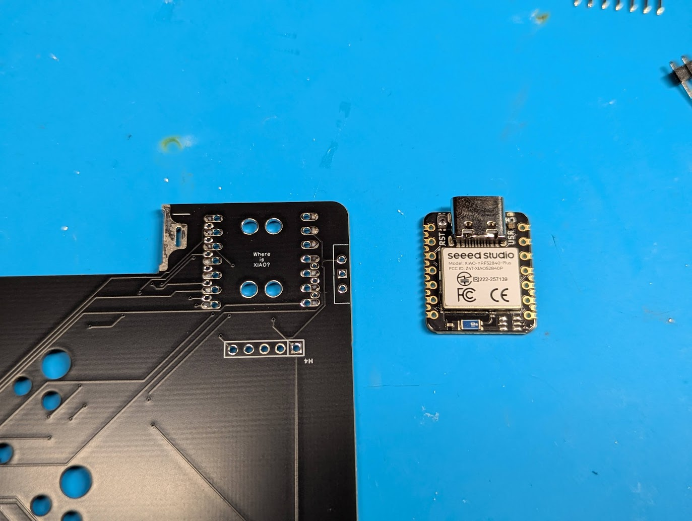
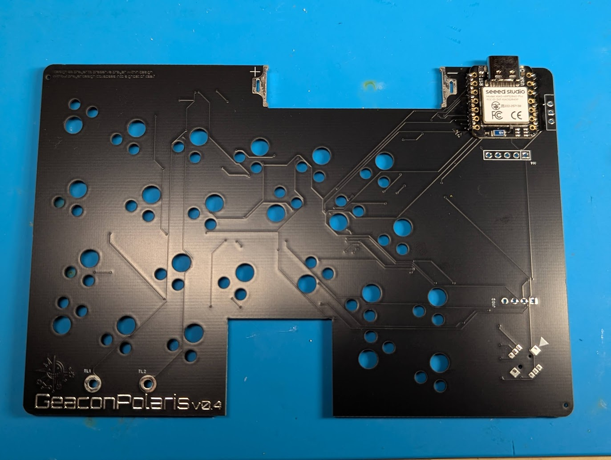
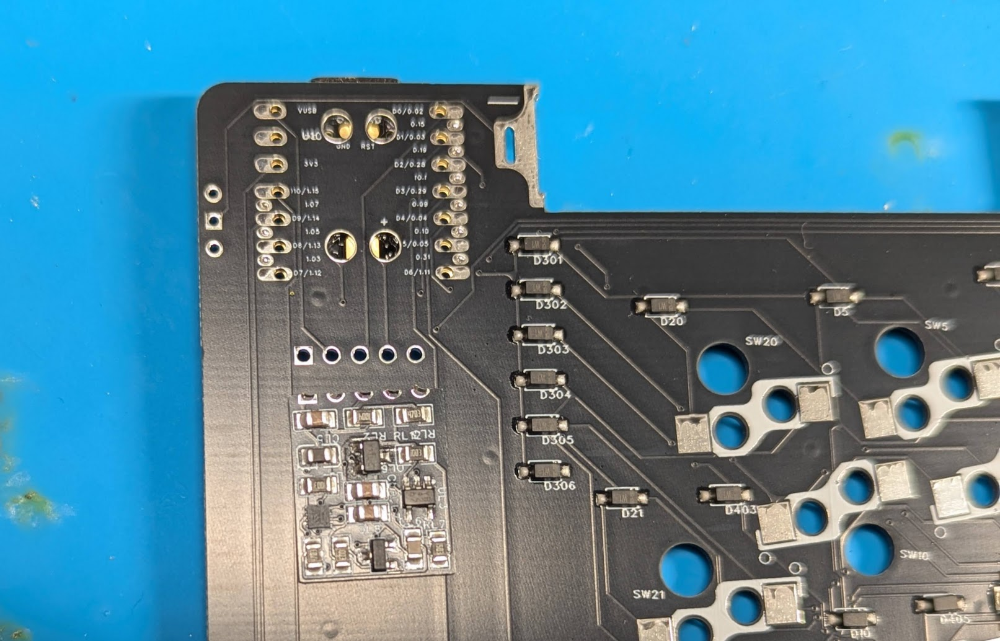
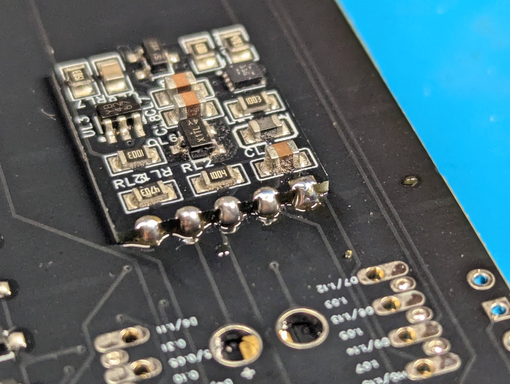
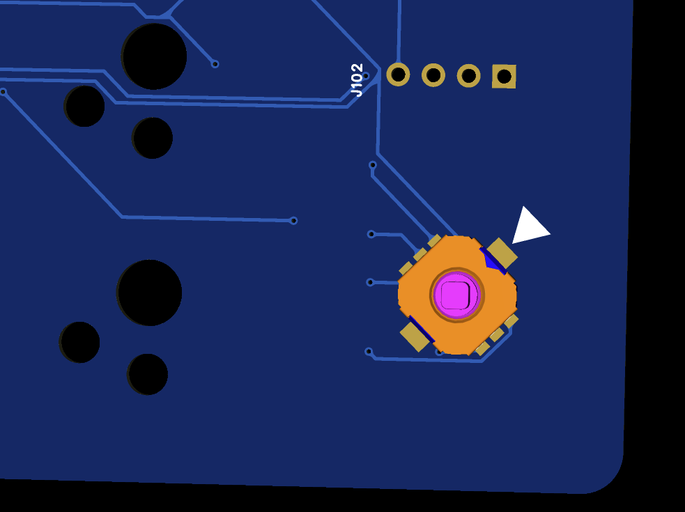
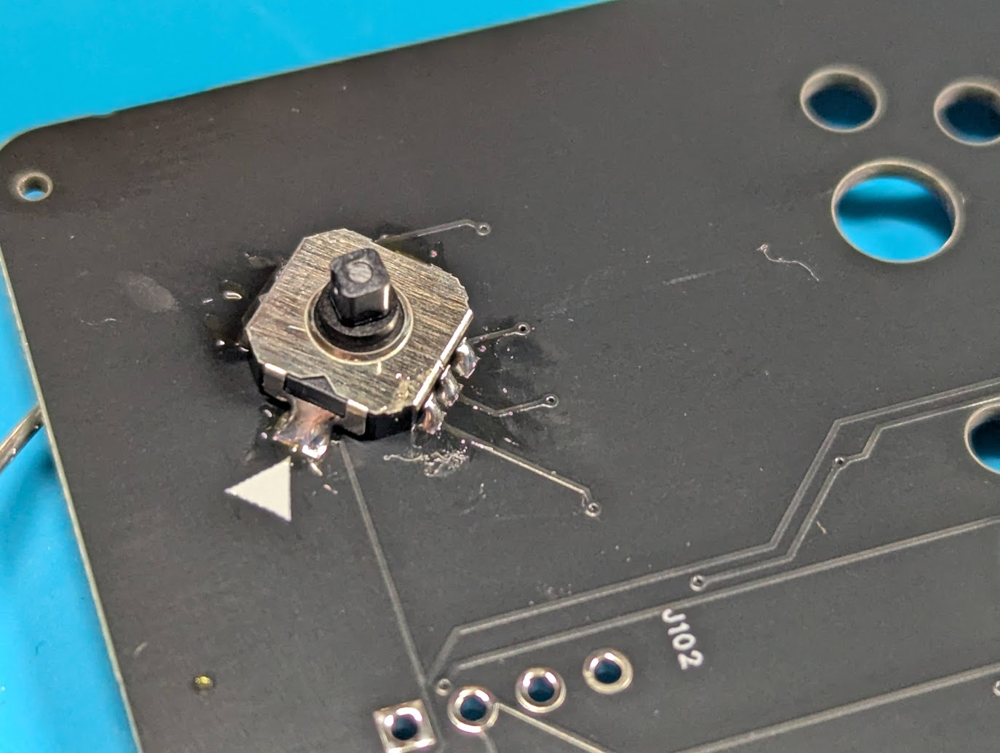
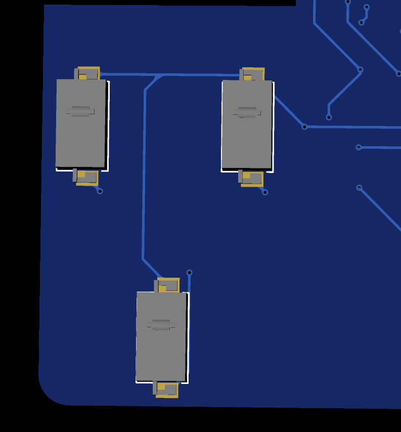

# キット内容物

| 名前 | 個数 | 備考 |
| --- | --- | --- |
| PCB（L） | 1 |  |
| PCB（R） | 1 |  |
| Xiao nRF52840 Plus | 2 |  |
| スライドスイッチ | 2 |  |
| 電池端子（＋） | 2 |  |
| 電池端子（ー） | 2 |  |
| 電池端子用治具 | 2 |  |
| FFCケーブル | 2 |  |
| キースイッチソケット（ChocV2用） | 46 |  |
| 5方向スイッチ  | 1 |  |
| マウススイッチ | 3 |  |
| M3ボルト | 8 |  |
| M3インサートナット | 8 |  |
| 透明ソフトプラ丸棒 | 1 | 切って使用する |
| OLED | 1 |  |
| ネオジウム磁石（3*2㎜） | 2 |バッテリーカバー用|
| M2ネジ | 2 |タッチセンサー用|

## その他必要なもの

| 名前 | 備考 |
| --- | --- |
| ハンダ付け用品 | おすすめはこちらに
[🔥某なれはて流・失敗しないハンダメソッド](https://note.com/teporz/n/n470c54151472) |
| MeKaBuモジュール | 右手はトラックボールのみ使用可能
[MeKaBu Project - BOOTH](https://mekabukb.booth.pm/) |
| キースイッチ | 46個 |
| キーキャップ | 17mmピッチ |
| 単4電池 | 左右それぞれ1個。NiMH電池を使用してください。 |

# 印刷物
ケースデータはこちらに→[Github](https://github.com/te9no/zmk-config-GeaconPolaris/)
| 名前 | 個数 | 備考 |
| --- | --- | --- |
| ボトムケース（L） | 1 |  |
| ボトムケース（R） | 1 |  |
| トップケース（L） | 1 |  |
| トップケース（R） | 1 |  |
| プレート（L） | 1 |  |
| プレート（R） | 1 |  |
| バッテリーカバー | 2 |  |
| 方向スイッチノブ | 1 |  |
| マウスボタン | 1 |  |
| リセットスイッチボタン | 2 |  |
| 電源スイッチアダプタ（L） | 1 |  |
| 電源スイッチアダプタ（R） | 1 |  |
| 電池端子用治具 | 2 |  |

[25mmボール用ケースのデータ](https://github.com/te9no/MeKaBu-public-data/blob/main/mechanical_data/TB/torabo25mm_top.stl)

# 基板組み立て

## ソケットのハンダ付け

ソケットの向きに注意しながらハンダ付けする。

★写真

## マイコンのハンダ付け

取り付ける面をよく確認してからずれないようにハンダ付けする。

## 電源昇圧基板のハンダ付け

取り付ける面をよく確認してからずれないようにハンダ付けする。
⚠️本体基板と電源昇圧基板の四角のパッドが一致します。

## 電池端子のハンダ付け

電池端子は足を折り曲げる。

★写真

電池端子用治具を基板と電池端子の隙間に入れてハンダ付けする。

★写真

## OLEDのハンダ付け

基板と水平になるようにしてハンダ付けする。

★写真

## 方向スイッチのハンダ付け

切り欠きの向きに注意してハンダ付けする。
⚠️本体基板の▲と方向スイッチの切り欠きが一致します。

## スライドスイッチのハンダ付け

取り付ける面をよく確認してからハンダ付けする。

## マウススイッチのハンダ付け

向きに注意してハンダ付けする。

## タッチセンサーの取り付け

タッチセンサーボタンをねじ止めする。

★写真

# ケースの組立

## インサートナットの取り付け

内径が小さい方を下にしてインサートナットを穴に置く。

加熱したはんだごてを使用して溶かしながら押し込んでいく。

※こて先が細くインサートナットの穴の中を貫通するものを使用する場合、ボトムケースの底に穴が開く可能性があるので注意。

## モジュールカバーの取り付け

アナログスティックモジュール以外を使用する場合はボトムケースの切欠き部分にカバーを取り付ける。

## モジュールの取り付け

モジュールの組立については以下を参照すること。

[MeKaBuモジュール組み立てガイド](https://modulable-keyboard-developer.github.io/guides/04module/)

モジュールにFFCケーブルを取り付ける。

ボトムケースにモジュールハウジングがしっかりはまり込むように取り付ける。

## リセットボタンの仮固定

リセットボタンの向きに注意してケースに差し込む。

マスキングテープなどでリセットボタンが飛んでいかないように貼り付ける。

## バッテリーカバーの組立

マグネットを圧入する

# 全体組立

## モジュールの接続

PCBにモジュールから伸びたFFCケーブルを接続する。

## ケース組立

プレートを配置する

マウスボタンを取り付ける

トップケースを配置する

ケースをねじ止めする

バッテリーカバー用ネジを取り付ける