# キット内容物

| 名前 | 個数 | 備考 |
| --- | --- | --- |
| PCB（C） | 1 |  |
| PCB（L） | 1 |  |
| PCB（R） | 1 |  |
| Xiao nRF52840 | 1 |  |
| スライドスイッチ | 1 |  |
| 電池端子（＋） | 1 |  |
| 電池端子（ー） | 1 |  |
| 電池端子用治具 | 1 |  |
| 6pin FFCケーブル | 1 |  |
| 10pin FFCケーブル | 2 |  |
| マウススイッチ | 3 |  |
| M3ボルト | 16 |  |
| M3インサートナット | 16 |  |
| 透明ソフトプラ丸棒 | 1 | 切って使用する |
| M2ネジ | 2 | |

## その他必要なもの

| 名前 | 備考 |
| --- | --- |
| ハンダ付け用品 | おすすめはこちらに
[🔥某なれはて流・失敗しないハンダメソッド](https://note.com/teporz/n/n470c54151472) |
| キースイッチ | 48個 |
| キーキャップ | 48個 |
| 単4電池 | 1個。NiMH電池を使用してください。 |

# 印刷物
ケースデータはこちらに→[Github](https://github.com/te9no/zmk-config-GeaconPolaris/)
| 名前 | 個数 | 備考 |
| --- | --- | --- |
| 中央ボトムケース | 1 |  |
| 中央トップケース | 1 |  |
| ミッドケース（L） | 1 |  |
| ミッドケース（R） | 1 |  |
| スイッチプレート | 2 |  |
| ボトムカバープレート | 2 |  |
| バッテリーカバー | 1 |  |
| マウスボタン | 1 |  |
| リセットスイッチボタン | 2 |  |
| 電源スイッチアダプタ | 1 |  |
| 電池端子用治具 | 2 |  |

# 基板組み立て

## ソケットのハンダ付け

ソケットの向きに注意しながらハンダ付けする。

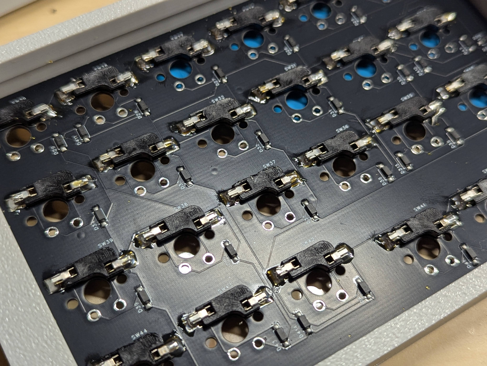

## マイコンのハンダ付け

取り付ける面をよく確認してからずれないようにハンダ付けする。
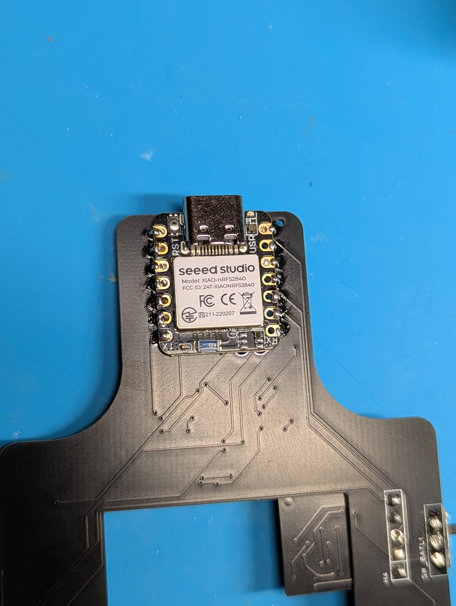

## 電源昇圧基板のハンダ付け

取り付ける面をよく確認してからずれないようにハンダ付けする。
⚠️本体基板と電源昇圧基板の四角のパッドが一致します。
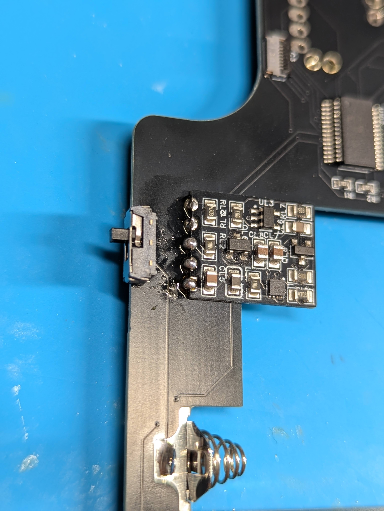

## スライドスイッチのハンダ付け

取り付ける面をよく確認してからハンダ付けする。

## マウススイッチのハンダ付け

向きに注意してハンダ付けする。
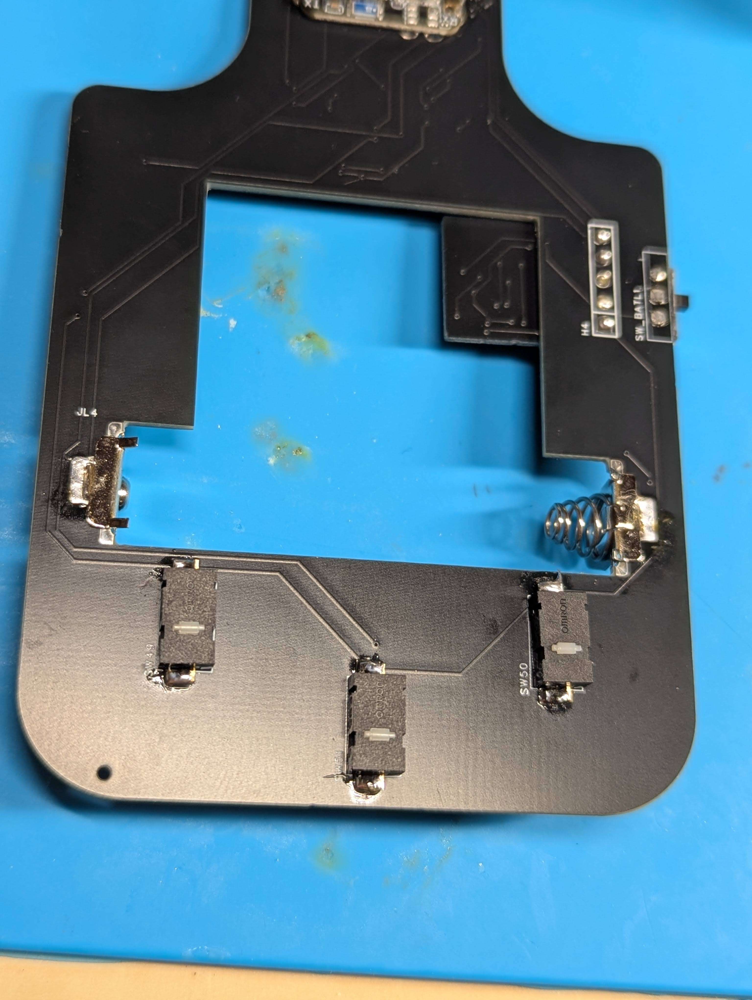

## 電池端子のハンダ付け

電池端子は足を折り曲げる。

電池端子を基板に密着するようにハンダ付けする。

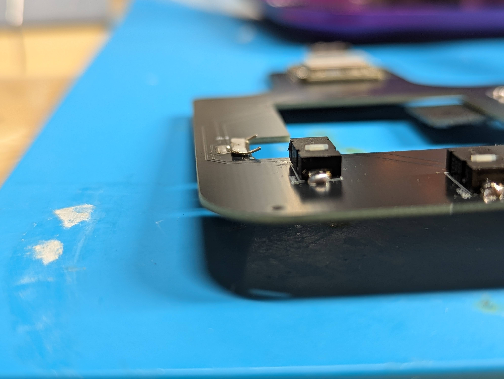

# ケースの組立

## インサートナットの取り付け

内径が小さい方を下にしてインサートナットを穴に置く。

加熱したはんだごてを使用して溶かしながら押し込んでいく。

※こて先が細くインサートナットの穴の中を貫通するものを使用する場合、ボトムケースの底に穴が開く可能性があるので注意。

## トラボセンサーの取り付け

向きに注意して、トラボセンサー基板にセンサーを取り付ける。
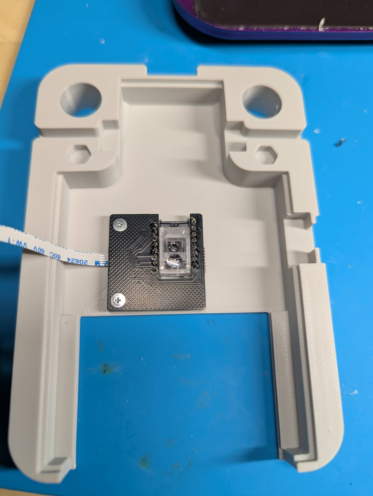

モジュールにFFCケーブルを取り付ける。

ボトムケースにねじ止めする。

## 電源スイッチの取り付け

スイッチの向きに注意してケースに差し込む。
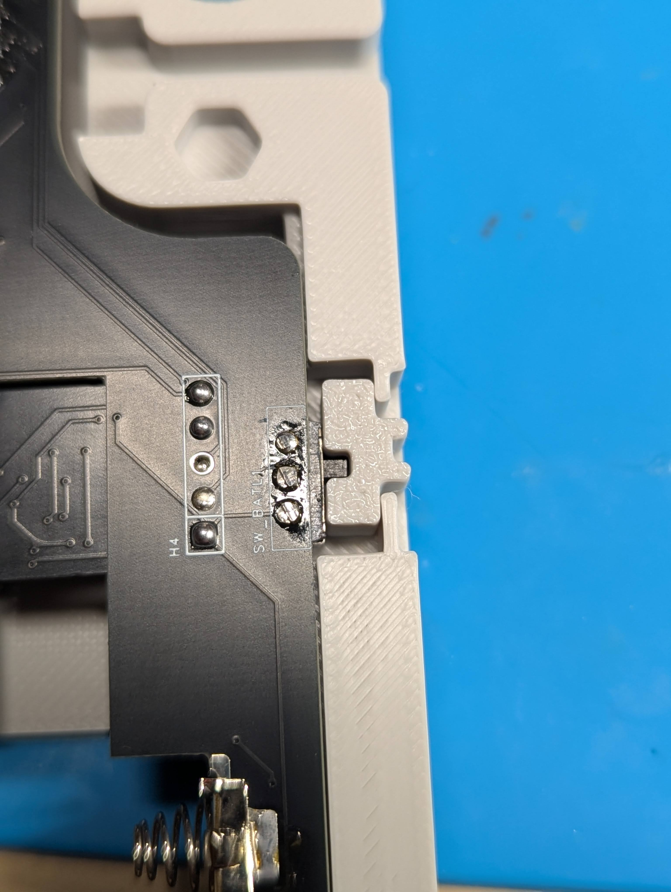

## リセットボタンの仮固定

リセットボタンの向きに注意してケースに差し込む。
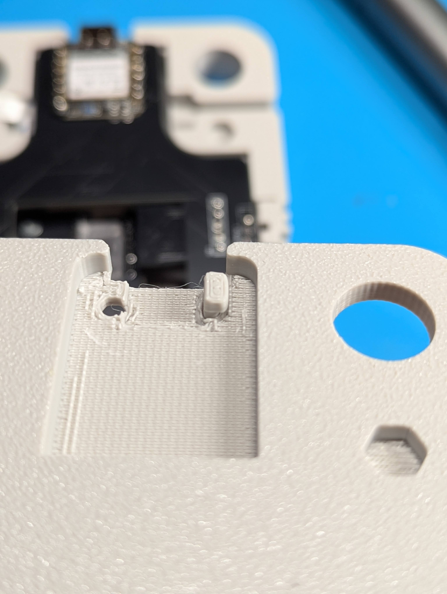
マスキングテープなどでリセットボタンが飛んでいかないように貼り付ける。

# 全体組立

## トラボ基板の接続

PCBにトラボ基板から伸びたFFCケーブルを接続する。

## 左右基板の接続

PCBにFFCケーブルを接続する。
⚠️FFCケーブルに折り目がつかないように、緩く曲がるようにしてください。
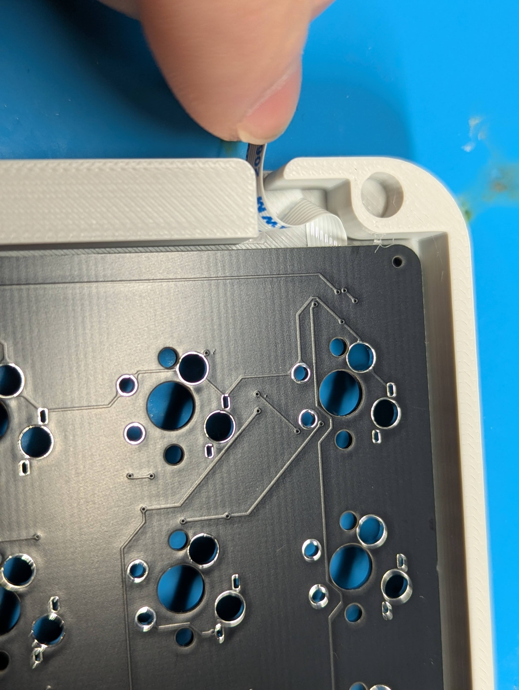

中央基板にFFCケーブルを接続する。
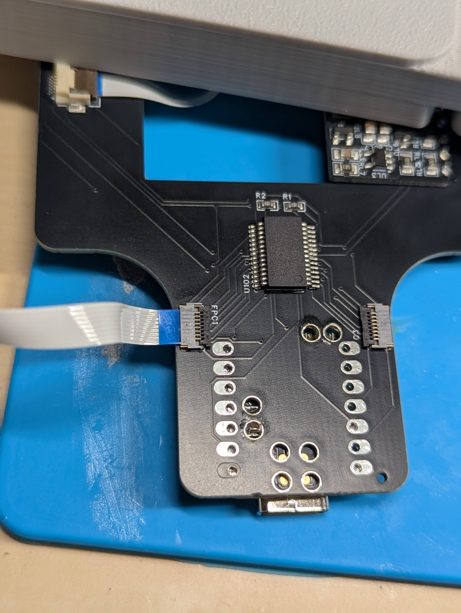

FFCケーブルは中央ケース内部に収納します。
⚠️FFCケーブルに折り目がつかないように、緩く曲がるようにしてください。
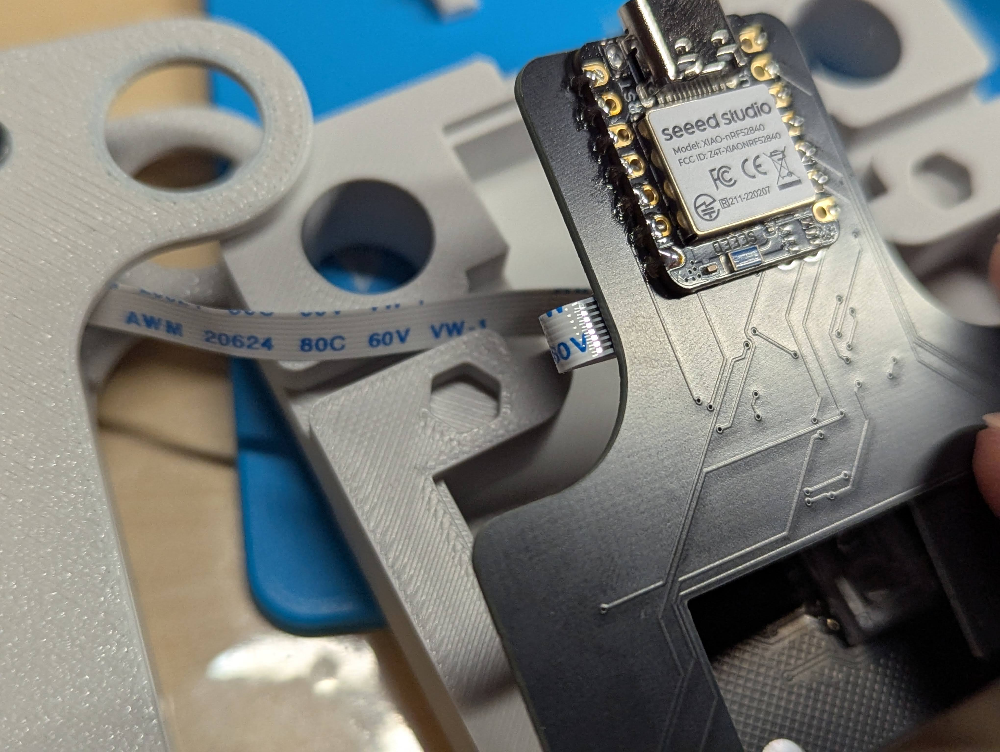
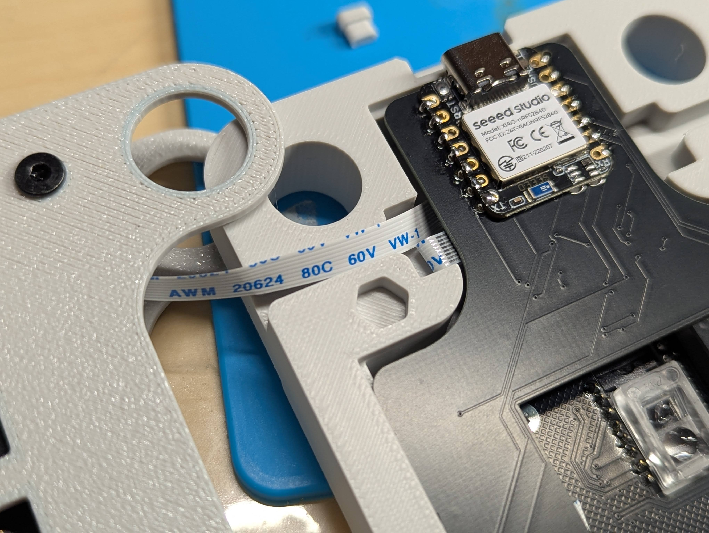

## ケース組立

プレートを配置する

マウスボタンを取り付ける

トップケースを配置する

ケースをねじ止めする

バッテリーカバー用ネジを取り付ける